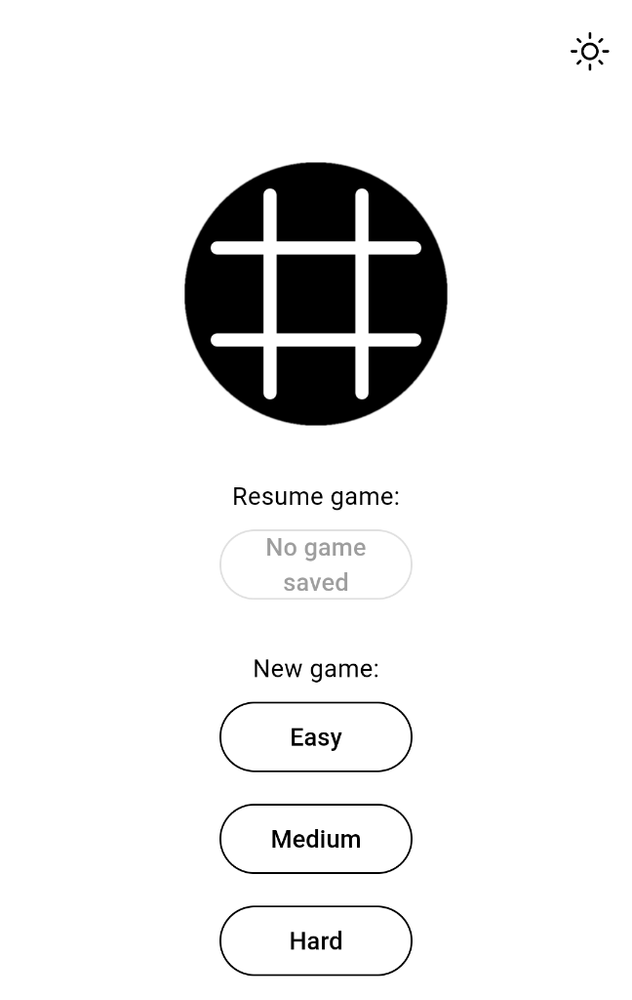
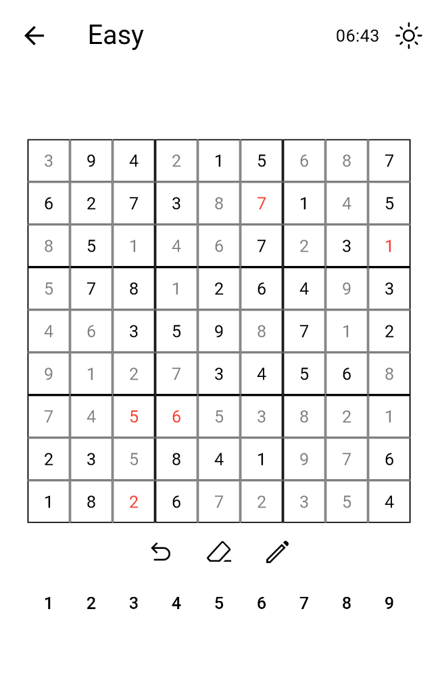
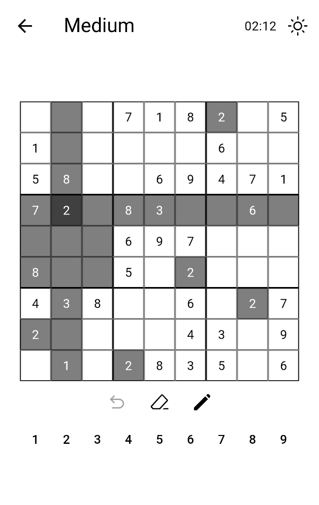
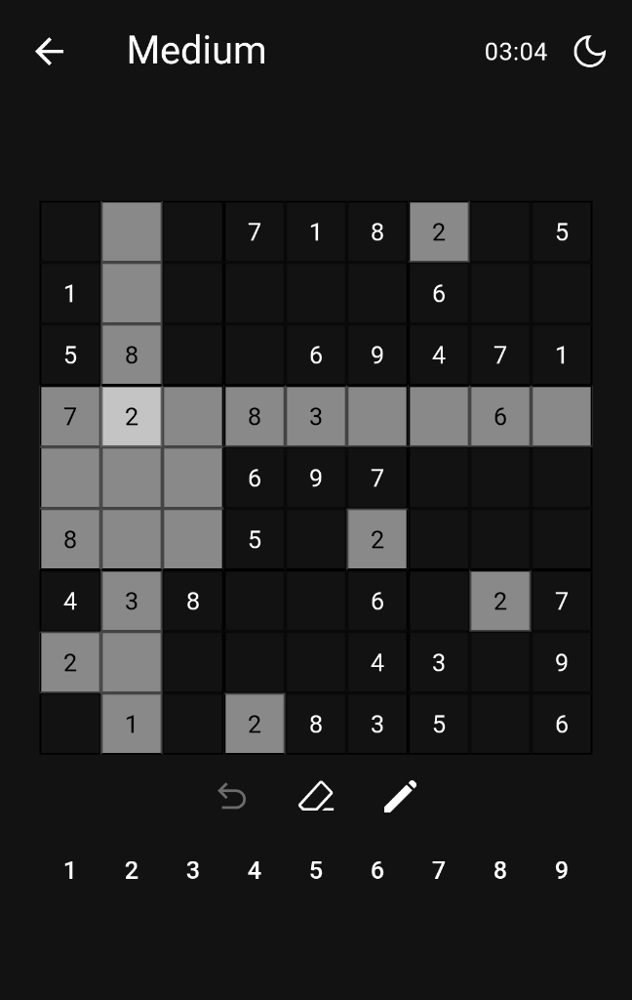
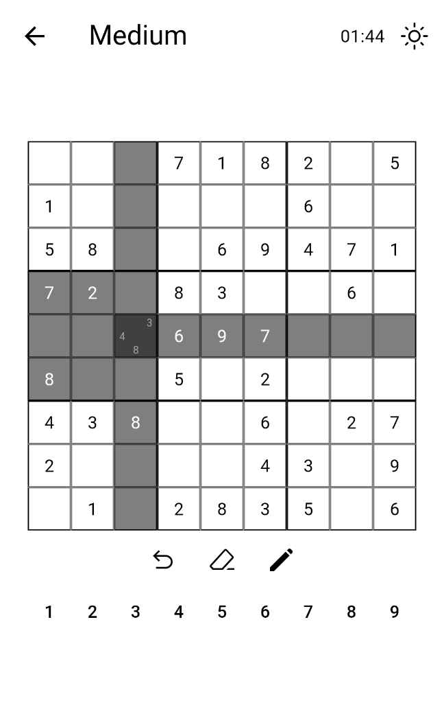
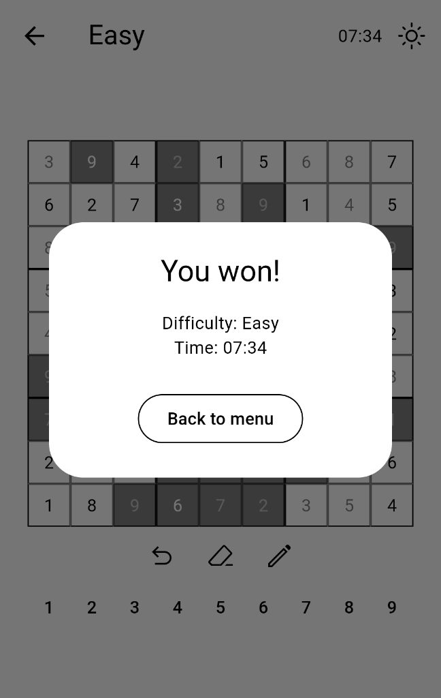

# [Simple Sudoku App in Flutter](https://github.com/Mano176/sudoku_flutter_app)
[//]: <> (description_start)

This is a simple Sudoku app written in Flutter with the following features:  
- 🛠️ Sudoku generation
    - with different difficulty levels
- ✅ Sudoku solving
- ✏️ note-mode for writing down possible cell values
- ↩️ undo-button for undoing previous moves
- ❌ eraser-button for deleting cell values
- 💾 saving the game's state for continuing at a later time
- ⏱️ timer for tracking the time needed to solve the Sudoku
- 🌙 dark and light mode

[//]: <> (description_end)

[//]: <> (images_start)

     
    Start screen

     
    Error detection

     
    Marking clicked row, column, square and cells with the same value

     
    Dark mode

     
    Note mode

     
    Win screen

[//]: <> (images_end)